# Project 3 - Tic-Tac-Toe. (Jumanji style)

##### Content table

- [Description](#description) :speech_balloon:
  - [The Challenge](#the-challenge)
  - [Screenshots](#screenshots)
  - [Links](#links)
- [Work-flow](#work-flow) :man_technologist:
  - [Created with](#created-with)
- [Author](#author)
- [License](#license)

## Description

### The challenge

For this time, our third project in this bootcamp I am doing with GeeksHubs we are asked to create a Tic-tac-toe.

We have to include a few html pages to work around with the SessionStorage. There fore we had to include minimum the main one as the index, a game page with the board, a players and a winner one.

Very important to have a fine working responsive system to be able to play on big screens and small screens, like mobile phones.

### Screenshots

|Welcome page - Big screen version|
|-|
|I decided to create a tic tac toe with a Jumanji look-alike.| 
To start with this design, firstly, I created on the main (index) page a box resembling the folded board game similar to Jumanji. Secondly, to add some fun to the USERS EXPERIENCE from the very beginning, I added the option to activate the original drums sound effects from the movie with "WITH MUSIC", which will automatically make the sound play when the user hovers over the game. Not only that but, added also the hovering effect that simulates the game opening and showing up whats inside.|
|To start the game the player has to click anywhere on the game, as it says on the welcome message.|
|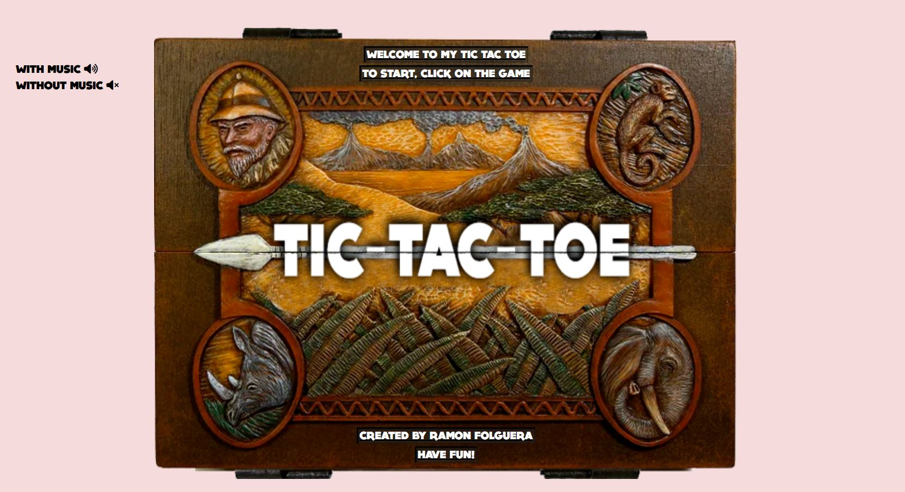|
|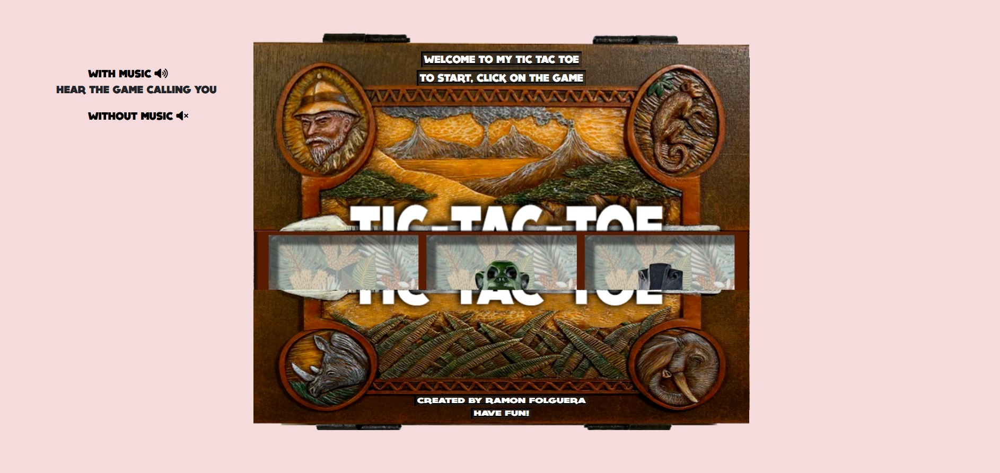|

|Players page - Big screen version|
|-|
|When landing on this page. The player or players are guided to introduce their names and choose a token they will play with between 4 choices. They are the four pieces used in the movie. 
|We included aswell an option to play against the CPU. When a player chooses to play against the CPU, the latest will place the token selected for it right after the player places theirs. 
To start the game when you are ready just need to click on START. If you forgot to introduce a name, or select a token, a pop up window will come up and inform you if there is a name or a token selection missing.|
|Finally, if everything is correct you will start the game!|
|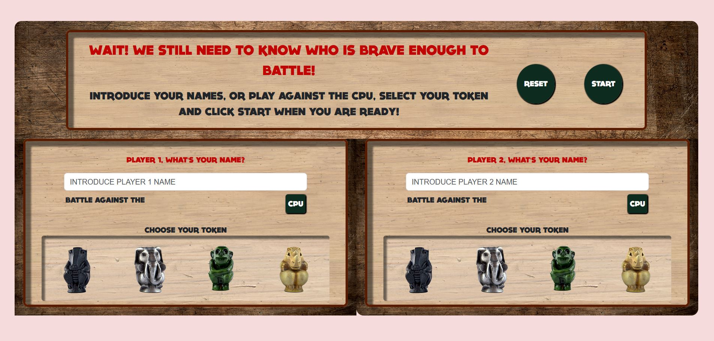|
|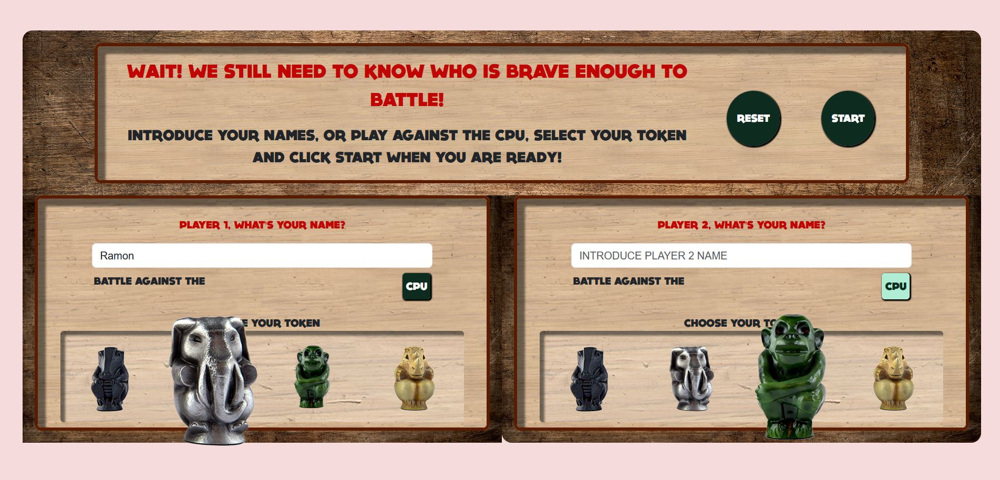|

|Game page - Big screen version|
|-|
|The game will always start with Player 1, when it's a Player vs Player. But if it is a Player vs CPU, will always start with the Player, either 1 or 2.|
|Everytime the turn jumps from one player to another, on the players panel they will see a YOUR TURN message indicating it is their turn. Also their token and their name will show all the time.|
|To win one player has to manage to place three tokens in line. If all tokens are placed and no one wins, players will have to pick one token and place it again until one of them wins.|
|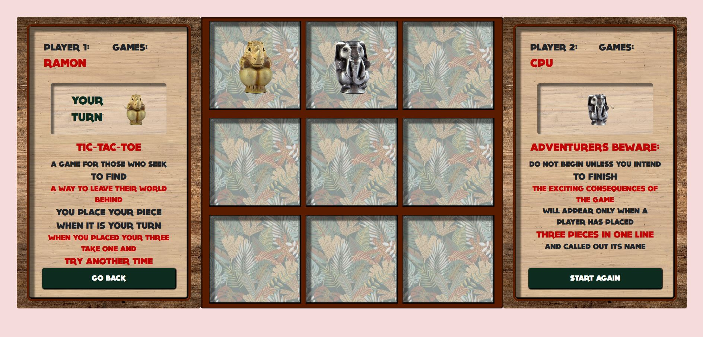|
|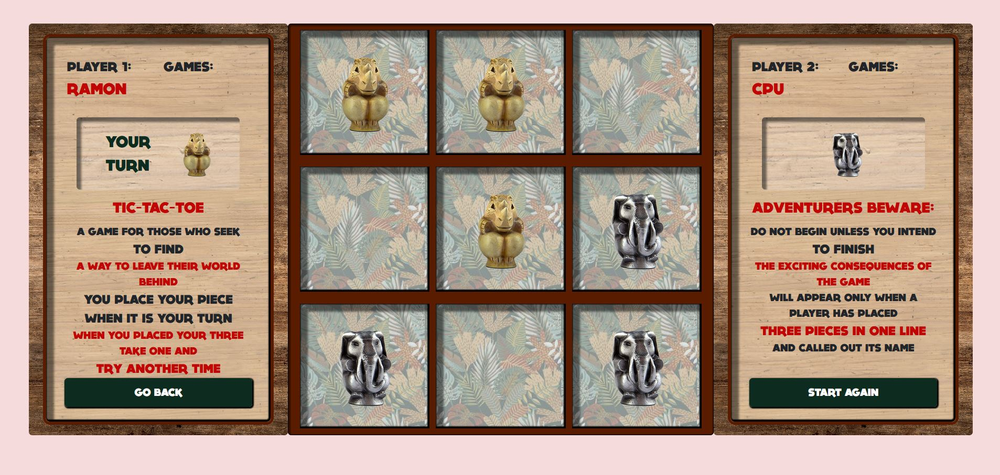|

|Winner page - Big screen version|
|-|
|This is the last page, where the winner recieves a congratulations message, and their token shows with a rotating effect. Players can click play again and add their win to the score counter, or click go back to main page.|
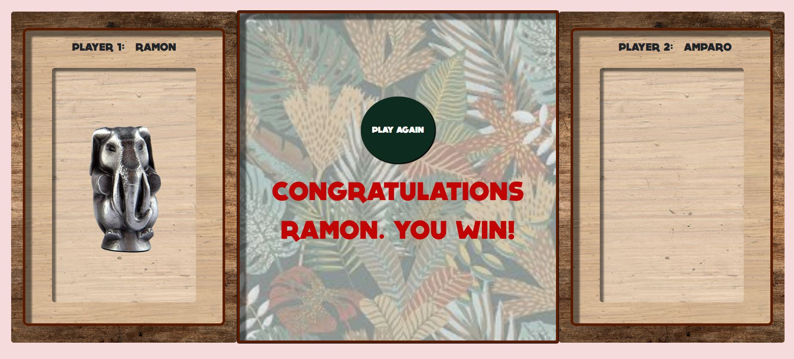

|Welcome page - Small screen version|Payers page - Small screen version|Game page - Small screen version|Winner page - Small screen version|
|-|-|-|-|
|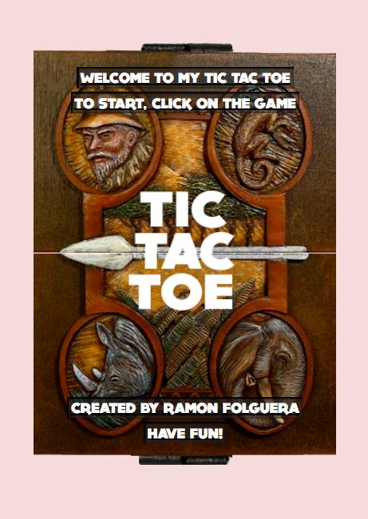|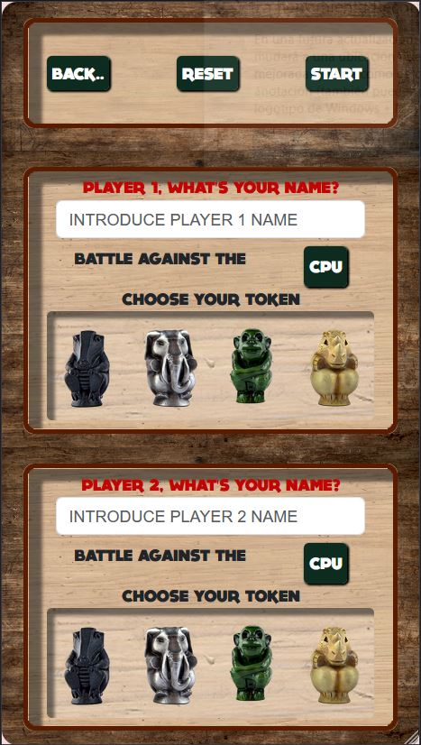|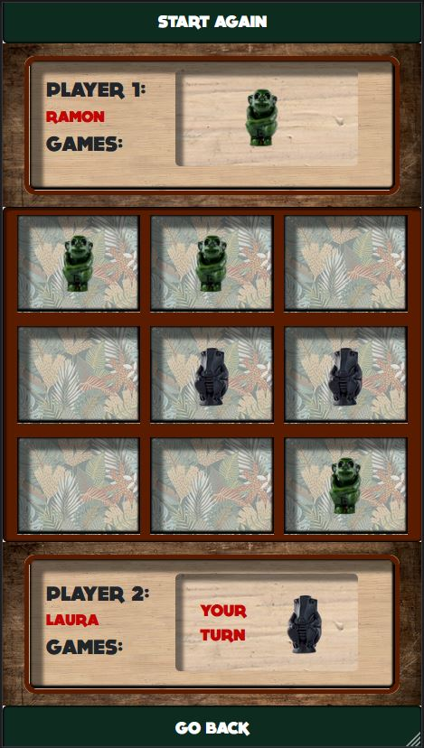|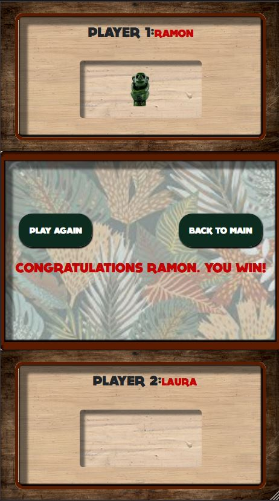|

### Links

- [Game](https://ramonfolguera.github.io/rfc-geekshubs-fsd-val-proyecto3-12022023/)
- [index.html](https://github.com/RamonFolguera/rfc-geekshubs-fsd-val-proyecto3-12022023/blob/master/index.html)
- [game.js](https://github.com/RamonFolguera/rfc-geekshubs-fsd-val-proyecto3-12022023/blob/master/js/game.js)
- [Main CSS](https://github.com/RamonFolguera/rfc-geekshubs-fsd-val-proyecto3-12022023/blob/master/css/game.css)

## Workflow

### Created with

- HTML5
- CSS customised properties
- BOOTSTRAP 
- Mobile-first 
- JavaScript 

### Autor

- Ramón Folguera Carbonell

### License

This project has been created under a MIT License. To learn more about the details go to LICENSE.md.

