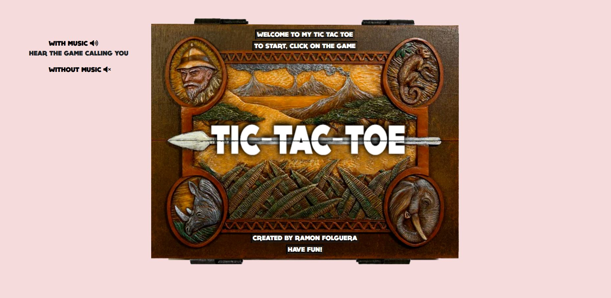
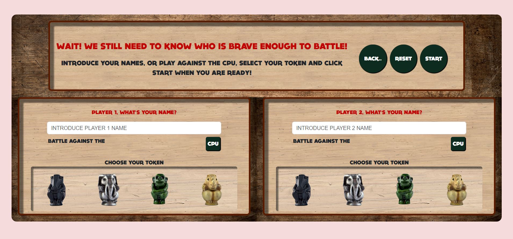
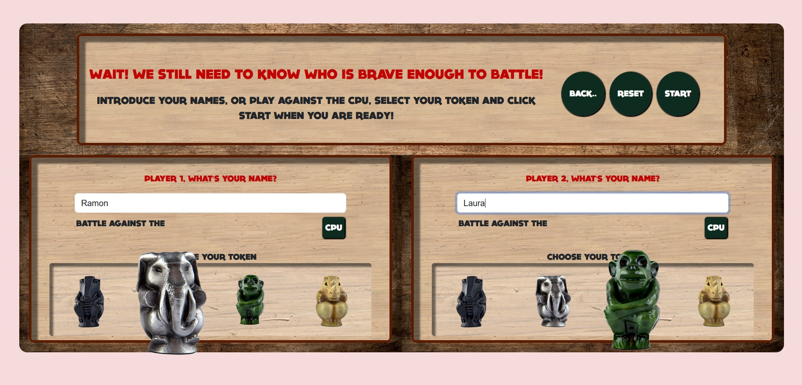

# Project 3 - Tic-Tac-Toe. (Jumanji style)

##### Content table

- [Description](#description)
  - [The Challenge](#the-challenge)
  - [Screenshots](#screenshots)
  - [Links](#links)
- [Work-flow](#work-flow)
  - [Created with](#created-with)
- [Author](#author)
- [License](#license)

## Description

### The challenge

For this time, our third project in this bootcamp I am doing with GeeksHubs we are asked to create a Tic-tac-toe.

We have to include a few html pages, including the main one as the index, a game page with the board, a players and a winner one.. 

Again very important to have a fine working responsive system to be able to play on big screens and mobile phones.

### Screenshots

|Welcome page - Big screen version|
|-|
|I decided to create a tic tac toe like it was a Jumaji board game. 
First thing we find when we access the main page is the welcome messages, the option to turn on music and that if you hover over the game it opens a bit showing the inside and activating the drums sound like in the movie.|
||
||

### Links

- [Game](https://ramonfolguera.github.io/rfc-geekshubs-fsd-val-proyecto3-12022023/)
- [index.html](https://github.com/RamonFolguera/rfc-geekshubs-fsd-val-proyecto3-12022023/blob/master/index.html)
- [game.js](https://github.com/RamonFolguera/rfc-geekshubs-fsd-val-proyecto3-12022023/blob/master/js/game.js)
- [Main CSS](https://github.com/RamonFolguera/rfc-geekshubs-fsd-val-proyecto3-12022023/blob/master/css/game.css)

## Workflow

### Created with

- HTML5
- CSS customised properties
- BOOTSTRAP 
- Mobile-first 
- JavaScript 

### Autor

- Ramón Folguera Carbonell

### License

This project has been created under a MIT License. To learn more about the details go to LICENSE.md.

